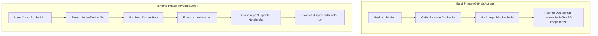

# Binder Configuration Files

This project uses a pre-built Docker image strategy to ensure fast launch times on Binder. Instead of building the environment from scratch on every launch, Binder pulls a ready-to-use image from DockerHub.

## Environment Architecture

## File Roles

- **`Dockerfile`**: Used only by Binder at runtime. It contains a `FROM` instruction pointing to the DockerHub image, which triggers an immediate pull instead of a full rebuild.
- **`environment.yml`**: Defines the Conda environment (Octave, xeus-octave, etc.). Used by the GitHub Action during the build phase.
- **`apt.txt`**: Contains system dependencies:
  - `libgl1-mesa-dev`: Required for Octave OpenGL support.
  - `xvfb`: Virtual Framebuffer used to run headless OpenGL.
- **`postBuild`**: Configures the Octave environment (path, package loading, and graphical toolkit) within the image.
- **`start`**: A runtime script that:
    1. Clones the latest `main` branch to a temporary directory.
    2. Synchronizes the notebooks and resources to the user's home directory.
    3. Wraps the Jupyter entrypoint with `xvfb-run` to support headless rendering.

## Maintenance

To update the environment:
1. Modify `environment.yml`, `apt.txt`, or `postBuild`.
2. Push changes to the repository.
3. The GitHub Action will automatically rebuild the image and push it to `bonassifabio/1rt485-image:latest`.